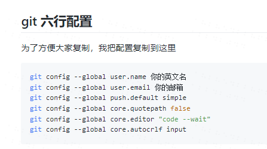

# 用markdown来学习写博客的第一天
## 一、这是一行代码
    
我是p标签

## 二、这是多行代码
~~~html
<h1>我是一级标题</h1>
<h2>我hi二级标题</h2>

    <a>我是a标签</a>

~~~
## 三、下图为git的六行配置代码图片

   
## 四、我喜欢的明星有
1. 赵丽颖
2. 肖战
3. 王一博
4. 杨幂
## 五、我今天做的事
- 上班
- 学习
- 学习写博客
- 看剧
- 打游戏